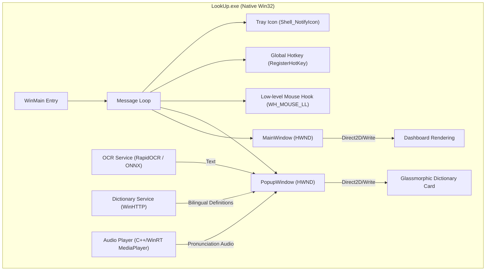

# 🚀 LookUp — Native Implementation Plan (Win32 + Direct2D)

This document details the architectural design and step-by-step build plan for **LookUp**, a native **Win32 + Direct2D + DirectWrite** C++ Windows application for instant pop-up dictionary lookups via screen OCR.

---

## 📋 Table of Contents
- [Architecture & Window Management](#architecture--window-management)
- [UI Layout & Rendering System](#ui-layout--rendering-system)
- [Feature Specification](#feature-specification)
- [System Dependencies (Zero-Dependency Strategy)](#system-dependencies-zero-dependency-strategy)
- [OCR Strategy Selection](#ocr-strategy-selection)
- [Implementation Phases](#implementation-phases)

---

## Architecture & Window Management

The application runs as a **single-process native Windows executable** containing two principal windows:

### 1. Main Dashboard Window (`MainWindow`)
- Standard Win32 window with a custom Direct2D background gradient, a modern interactive hotkey recorder, and status panels.
- Minimizes/closes to the system tray (`Shell_NotifyIcon`).

### 2. Floating Dictionary Popup (`PopupWindow`)
- Layered transparent window (`WS_EX_LAYERED | WS_EX_TOOLWINDOW | WS_EX_TOPMOST`).
- Custom painted using Direct2D with a rounded glassmorphism aesthetic, a progress bar timer, and smooth fades.
- No border, no title bar, and does not show in the taskbar.

---

## UI Layout & Rendering System

The UI is built entirely on **Direct2D** for rendering and **DirectWrite** for high-quality, DPI-aware typography — no HTML/CSS layer at any point.

### Rendering Workflow (D2D/DWrite)
1. **D2D Render Target:** Create an `ID2D1HwndRenderTarget` bound to the window's `HWND`.
2. **Double Buffering:** Handled natively by Direct2D to ensure zero flicker.
3. **Glassmorphism Layer:** Draw a rounded rectangle with a semi-transparent fill (`D2D1::ColorF(0.07f, 0.08f, 0.14f, 0.85f)`) and a glowing border.
4. **Text Layout:** Use `IDWriteTextLayout` to wrap meanings, pronunciation tags, and definitions.
5. **Interactive Buttons:** Bounds-check mouse coordinates during `WM_LBUTTONDOWN` and `WM_MOUSEMOVE` to render hover effects and capture clicks (Copy / Listen / Close).

---

## Feature Specification

| Feature | Implementation Approach |
|---|---|
| **Entry Point** | `WinMain` in `src/main.cpp` |
| **Window Layout** | Custom paint handlers in `WM_PAINT` |
| **Animations** | Framerate-independent `QueryPerformanceCounter` step updates |
| **Middle-Click Trigger** | `SetWindowsHookEx` (`WH_MOUSE_LL`) on a worker thread |
| **Global Hotkey** | Win32 `RegisterHotKey` / `WM_HOTKEY` |
| **Tray Icon** | `Shell_NotifyIcon` + custom context menu |
| **JSON Parsing** | `nlohmann/json` (header-only) |
| **HTTP Client** | Windows native **WinHTTP API** (async, zero external dependencies) |
| **Audio Playback** | C++/WinRT `Windows::Media::Playback::MediaPlayer` |
| **Settings Storage** | `nlohmann::json` persisted to `%APPDATA%\LookUp\config.json` |

---

## System Dependencies (Zero-Dependency Strategy)

To keep the application modular and avoid heavy runtimes, the build maximizes use of built-in Windows APIs:

1. **WinHTTP (`winhttp.lib`):** Handles async dictionary API calls. Native, fast, handles SSL/TLS natively via the OS.
2. **C++/WinRT (`windowsapp.lib`):** Used for `MediaPlayer` (pronunciation MP3 playback) and clipboard management.
3. **nlohmann/json:** Bundled header-only JSON parser.
4. **Direct2D / DirectWrite (`d2d1.lib`, `dwrite.lib`):** Built-in Windows hardware-accelerated rendering.

---

## OCR Strategy Selection

`Windows.Media.Ocr` was evaluated but ruled out: it officially requires package identity (MSIX or sparse packaging), which conflicts with the xcopy-deployable, zero-install-friction goal of this app. Instead, LookUp embeds its own OCR engine directly in-process.

### Embedded RapidOcrOnnx (DirectML / ONNX Runtime)
- **Engine:** RapidOCR (C++) linking against `onnxruntime.dll` (utilizing DirectML for GPU acceleration).
- **Footprint:** ~15 MB DLL + ~20 MB models.
- **Accuracy:** Extremely high, cross-platform, supports custom dictionaries.
- **Deployment:** Fully in-process, no external service, no package identity, no install step beyond xcopy — consistent with the rest of the app's zero-dependency strategy.

---

## Implementation Phases

### Phase 1: Project Scaffolding
- Configure `CMakeLists.txt` for C++20, Direct2D (`d2d1`), DirectWrite (`dwrite`), and WinHTTP (`winhttp`).
- Create `main.cpp` with a standard Win32 message loop and a tray icon listener.

### Phase 2: Direct2D Renderer & Fonts
- Implement `D2DRenderer` class.
- Load custom fonts (Inter) via DirectWrite.
- Set up double-buffered drawing loop for custom UI.

### Phase 3: Dashboard & Hotkey Recorder
- Implement `MainWindow` subclass.
- Create custom-drawn input fields for recording hotkeys.
- Save settings to `%APPDATA%\LookUp\config.json`.

### Phase 4: Popup Window & DirectWrite Layout
- Implement transparent `PopupWindow`.
- Create slide-in animation and progress bar countdown.
- Add mouse hover detection to pause the countdown.

### Phase 5: Hook Listener & Dictionary Client
- Set up `SetWindowsHookEx` on a worker thread.
- Write async `WinHTTP` client for `dict.minhqnd.com` and `dictionaryapi.dev`.
- Integrate audio player for pronunciation URLs.

### Phase 6: OCR Integration & Polish
- Wire up screenshot capture (`BitBlt`) and the OCR pipeline.
- Verify DPI scaling compatibility for multi-monitor setups.
